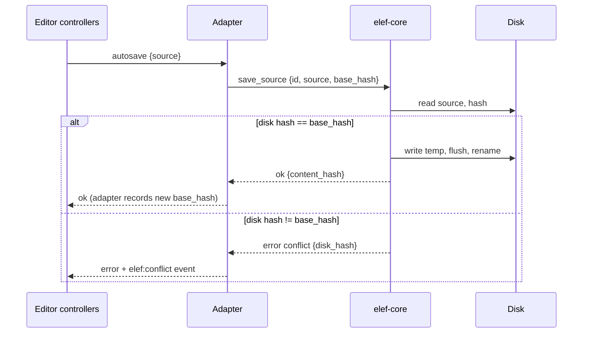

# ADR-008: Atomic writes, fingerprint checks, and a conflict UI

- Status: **Proposed**
- Date: 2026-10-01
- Decider: Andres
- Confidence: high on the approach; medium on exact durability and latency costs (measured in M2)
- Accepted when: the fault-injection matrix (QS-2) and conflict interleaving tests (QS-3) pass in M2
- Amends: the "last-write-wins in v1" line in [ADR-001](001-folders-as-source-of-truth.md)

## Context

Auto-save is continuous, and other programs (editors, Dropbox, iCloud, Syncthing) can write the same files at any time. The v2 docs contradicted themselves: ADR-001 said last-write-wins, [architecture.md](../architecture.md) said never silent last-write-wins. The product is user-owned files, so silent loss is the worst failure. This decision had no ADR of its own.

## Options considered

- **Last-write-wins.** Simple; silently destroys someone's edits. Rejected.
- **File locking.** Not honored by editors or sync tools. Rejected as the primary mechanism.
- **Optimistic concurrency with a fingerprint + conflict UI** (chosen).
- **CRDT/merge on every save.** Heavy and unnecessary for single-user, single-source-file decks.

## Decision (proposed)

1. **Atomic save.** Write a temp file in the same directory (dot-prefixed, so discovery ignores it), flush it to disk (`sync_all`; verify latency in M2), rename over the target. A crash leaves the old or the new file, never a mix. Stale temp files from a crash are removed on the next open.
2. **Fingerprint.** (mtime, size, content hash) of the *source file*, recorded at every load and successful save. Images are written once and are not part of the autosave path, so hashing the source (typically KBs to low MBs) before each save is cheap.
3. **Check before write.** Before each save, re-read and hash the source file; if it differs from the recorded fingerprint, do not write — raise a `conflict`. The adapter supplies the last-known hash as `base_hash` ([transport-adapter.md](../transport-adapter.md)).
4. **Conflict UI:** keep mine / keep theirs / merge view. The buffer stays dirty and in memory until resolved. "Keep theirs" reloads from disk and leaves the discarded text on the session undo stack so it is recoverable in-session.
5. **Watcher is a hint, the fingerprint is the truth.** File-watcher events (debounced) trigger a fingerprint check; events caused by our own writes are suppressed by comparing hash to the last-written hash. No unsaved changes → silent reload; unsaved changes → conflict UI.
6. **One writer per deck.** Saves are serialized per deck and coalesced (latest wins).
7. **Residual race:** the check and the rename are not one atomic step, so an external write in that millisecond window can still be lost. Narrow it by re-checking immediately before rename; document it; do not claim it is eliminated.

## Consequences

- QS-2 and QS-3 become testable: the Rust core exposes fault-injection hooks at four save points ([test-strategy.md](../test-strategy.md) §5).
- One more UI surface (conflict dialog) and one more adapter behavior (hash handshake). Both are new code, kept out of the reused controllers.
- Extra read+hash per save: negligible for source files; measured against the autosave budget.
- Safe on synced folders in the common cases; a sync tool producing a conflicted copy is handled by the source-file rule ([data-format.md](../data-format.md)).

## Revisit when

Saves are shown to miss the autosave budget, or the residual race is observed in practice.
