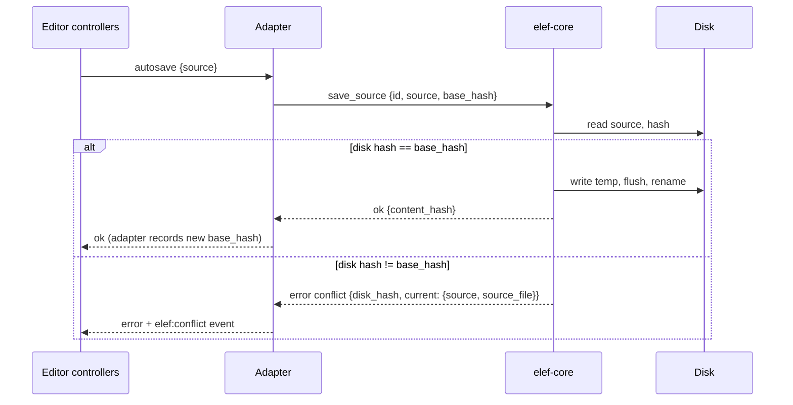

# ADR-008: Atomic writes, fingerprint checks, and a conflict UI

- Status: **Accepted**
- Date: 2026-10-01
- Decider: Andres
- Confidence: high on the approach; medium on physical power-loss evidence and the residual external-writer race
- Amends: the "last-write-wins in v1" line in [ADR-001](001-folders-as-source-of-truth.md)

## Context

Auto-save is continuous, and other programs (editors, Dropbox, iCloud, Syncthing) can write the same files at any time. The v2 docs contradicted themselves: ADR-001 said last-write-wins, [architecture.md](../architecture.md) said never silent last-write-wins. The product is user-owned files, so silent loss is the worst failure. This decision had no ADR of its own.

## Options considered

- **Last-write-wins.** Simple; silently destroys someone's edits. Rejected.
- **File locking.** Not honored by editors or sync tools. Rejected as the primary mechanism.
- **Optimistic concurrency with a fingerprint + conflict UI** (chosen).
- **CRDT/merge on every save.** Heavy and unnecessary for single-user, single-source-file decks.

## Decision

1. **Atomic save.** Write a temp file in the same directory (dot-prefixed, so discovery ignores it), flush it to disk (`sync_all`; verify latency in M2), rename over the target. A crash leaves the old or the new file, never a mix. Stale temp files from a crash are removed on the next open.
2. **Fingerprint.** (mtime, size, content hash) of the *source file*, recorded at every load and successful save. Images are written once and are not part of the autosave path, so hashing the source (typically KBs to low MBs) before each save is cheap.
3. **Check before write.** Before each save, re-evaluate the source-file rule and re-read/hash the selected source. If the selected filename or content differs from the recorded baseline, do not write — raise a `conflict` containing the current filename and source. Repeat this check immediately before replacement. The adapter supplies the last-known hash as `base_hash` ([transport-adapter.md](../transport-adapter.md)).
4. **Conflict UI:** keep mine / keep theirs / merge view. The buffer stays dirty and in memory until resolved. "Keep theirs" reloads from disk and leaves the discarded text on the session undo stack so it is recoverable in-session.
5. **Periodic check, fingerprint is truth.** While a deck is open, the desktop periodically reads and hashes its source. No unsaved changes → silent reload; unsaved changes → conflict UI. Own writes are recognized by their resulting content hash.
6. **One writer per deck.** Saves are serialized per deck and coalesced (latest wins). An outstanding write keeps the session dirty even if Undo returns the buffer to the previous baseline; navigation waits for the final buffer to persist. Native Quit and window close use the same save/conflict guard. The shell flushes pending visual projection edits before checking dirty state; a flush error keeps the window open. Deck opens are serialized and recheck the previous buffer after the target read so edits during that read persist before switching. Opening another deck creates a new CodeMirror history boundary and uses that source file’s line separator. Discarded recovery drafts carry their deck identity and can only restore into that deck.
7. **Accepted v1 residual race:** the check and rename are not one atomic step, so an external write in that final synchronous window can still be lost. Re-check immediately before rename, measure the check-to-rename window in CI (p95 below 250 ms), and show a note in the editor recommending sync-tool version history. Do not claim the race is eliminated.

## Consequences

- The four-point child-process kill matrix runs 50 times per point in Linux and macOS CI. It confirms complete old-or-new source bytes and stale-temp cleanup after process termination. The matrix does not simulate physical power loss; temporary-file `sync_all` and parent-directory sync after rename provide the durability path, but device-level power-loss behavior is not directly verified.
- QS-3 is exercised by core save checks, save-flow unit tests, and the shared webview conflict scenario. CI also measures the final fingerprint-check-to-rename interval against the 250 ms p95 budget. This narrows the accepted race; it does not eliminate an external write in that final interval.
- One more UI surface (conflict dialog) and one more adapter behavior (hash handshake). Both are new code, kept out of the reused controllers.
- Extra read+hash per save: negligible for source files; measured against the autosave budget.
- Safe on synced folders in the common cases; a sync tool producing a conflicted copy is handled by the source-file rule ([data-format.md](../data-format.md)).

## Revisit when

### Amendment 2026-10-03: navigation ownership

Pending deck reads do not advance the active save fingerprint. Graph and editor preparation finish while the old deck retains save ownership. If edits arrive during preparation, they save against that old fingerprint and the target is reread before activation. Installing the editor buffer and activating the target's fingerprint/save ownership occur synchronously, without an intervening await. A failed buffer installation deactivates saves and returns to the library. Deferred-read and deferred-graph unit tests cover same-deck stale snapshots, external-change conflicts, and typing into the prior deck during preparation.

Saves are shown to miss the autosave budget, or the residual race is observed in practice.
