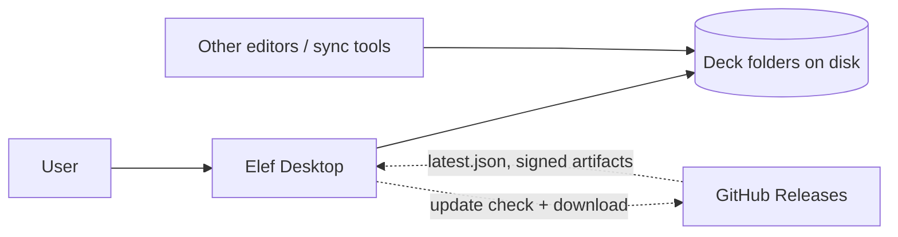
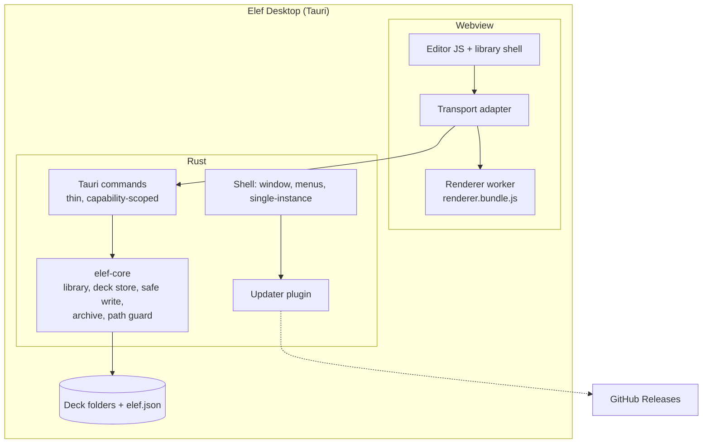

# Elef Desktop — Architecture

Status: draft v3 (2026-10-01). Structure follows arc42. Requirements and budgets live in [requirements.md](requirements.md); decisions and their reasoning live in [adr/](adr/README.md). This file states the current shape and links out rather than restating.

## 1. Context and scope

No server, no account. The only network traffic by default is the update check. Remote images are blocked in v1 (see [security.md](security.md), Q5); the bug-report endpoint is a stretch item with its own network decision. Other programs (editors, Dropbox/iCloud/Syncthing) write to the same folders at any time; the design treats that as normal.

## 2. Solution strategy

| Quality goal | Approach | Decision |
|---|---|---|
| 1 Editing parity | Reuse the editor JS verbatim; the transport adapter is the only seam | ADR-004 |
| 2 Data safety | Folders canonical; atomic writes; fingerprint check before every write; conflict UI, never silent overwrite | ADR-001, ADR-008 |
| 3 Security | Defense in depth that assumes any single layer can fail | ADR-006, [security.md](security.md) |
| 4 No divergence | One shared JS renderer; flags not branches; seams specified and contract-tested | ADR-007, ADR-005 |
| 5 Performance | Asset protocol for images; rendering in a worker; no cache in v1 | §6 |
| Delivery | Tauri updater + GitHub Releases, Ed25519-signed | ADR-002, ADR-009 |

Design principles
- **Seams get specs; internals don't.** The only places web/desktop divergence or data loss can enter are [data-format.md](data-format.md), [transport-adapter.md](transport-adapter.md), [security.md](security.md), [test-strategy.md](test-strategy.md).
- **Folders are truth; everything else is derived** and deletable.
- **Fail safe.** When unsure whether a write would lose bytes, surface a conflict instead of choosing.
- **Least privilege.** The webview can invoke a named command set; no generic filesystem or shell access.
- **UI-independent core.** File logic lives in a Rust crate with no Tauri dependency, so it is unit-testable and fault-injectable without a GUI, and survives a shell change (ADR-002 consequence).
- **Deletion over duplication.** Temporary duplication must have an end date and a deletion step.

## 3. Building blocks

| Block | Responsibility | Notes |
|---|---|---|
| Shell (Tauri) | Window lifecycle, native menus (File / Edit / View / Presentation / Window / Help / About), single-instance, updater | ADR-002 |
| Webview frontend | Reused CodeMirror/Stimulus editor controllers; desktop library shell, document graph view, conflict UI, presentation mode | ADR-004 |
| Transport adapter | Routes the controllers' existing JSON calls to Rust commands or to webview-local handlers; owns the hash handshake | [transport-adapter.md](transport-adapter.md) |
| Renderer worker | Runs the shared Markdown block renderer and desktop preview projection off the main thread. Emits Mermaid placeholders; Mermaid itself runs in the webview (needs a DOM). Desktop slide structure/editor maps are still a separate implementation from Rails | ADR-007 |
| Commands | Thin, validated entry points; each is on the capability allowlist | [security.md](security.md) |
| `elef-core` | Library scan, document graph, deck store, safe write, content-addressed media, `.elef` archive, path guard, `elef.json`. No UI, no Tauri types | ADR-003, ADR-008 |
| SQLite cache | **Deferred to post-v1**: nothing in v1 consumes it (search is out of scope; folder scans handle hundreds of decks). The rebuildable-cache principle stands; the component waits for its first consumer | ADR-001 |

Dependency rule: webview → adapter → commands → core → OS. Core never calls upward.

## 4. Runtime view

1. **Launch.** Single-instance check → scan library root (dot-folders skipped, symlinks not followed) → library view.
2. **Open deck.** Resolve the source file ([data-format.md](data-format.md)) → read source and record its fingerprint → create `elef.json` if absent (best effort; a read-only folder still opens) → load `.elef/` authoring entries → source editor and worker-rendered preview. Visual editing is enabled after a successful render.
3. **Edit and auto-save.** Debounced autosave → atomic write guarded by a fingerprint check → conflict UI on mismatch. Full protocol and sequence in ADR-008. Undo/redo is session-only.
4. **External change.** While a deck is open, a periodic source snapshot check detects edits from other programs. No unsaved changes → silent reload; unsaved changes → conflict UI. Every save still verifies the current fingerprint immediately before writing.
5. **Rename deck.** Folder rename; UUID in `elef.json` keeps identity; an open editor re-points.
6. **Export.** Zip the deck folder deterministically → `name.elef`.
7. **Import.** Extract to a staging dir under hardening limits ([security.md](security.md)) → UUID rule → move into library root. Collisions prompt: replace / keep both with new UUID / cancel.
8. **Update.** Check `latest.json` → download → verify Ed25519 signature against the baked-in public key → install → prompt relaunch. A failed update leaves the old version runnable (ADR-009).

Media insertion uses the reused Rails `media_controller`: a file is sent as a raw binary IPC payload, validated and stored as a content-addressed file under the selected deck's `images/`, then referenced from Markdown by digest. The read-only `elefasset` protocol serves that digest from the same deck; it cannot address an arbitrary path.

The document graph reuses the web `document-graph` Stimulus controller and derives its nodes and `[[title]]` edges from document deck files. It is an on-demand view; no graph cache or identity data is stored outside the source folders.

## 5. Deployment and distribution

| Platform | Artifact | Updater target |
|---|---|---|
| macOS (Apple Silicon) | `.app` / `.dmg`, unsigned and not notarized in v1 | Tauri updater archive |
| Linux (Arch/Omarchy) | AppImage | AppImage (Tauri's Linux updater target) |

Release path: tag → CI build matrix → sign updater artifacts → GitHub Release + `latest.json`. Key custody and rotation: ADR-009. Install and update UX per platform is verified in spikes S3 and S4.

Where state lives
- **Library root** (user-chosen, e.g. `~/Elef/`): deck folders and `.elef/` portable library settings. Safe to sync or back up.
- **OS app-data directory:** logs and device-local state (window geometry, recent files) — proposed, Q4.
- Nothing else. No hidden databases.

## 6. Cross-cutting concepts

- **Identity.** UUID in `elef.json`; folder name is display-only. Rules in [data-format.md](data-format.md).
- **Case and Unicode.** Folder names compared case-insensitively and after NFC normalization; import warns on collisions (macOS file systems may treat equivalent names as one; Linux does not).
- **Shared Markdown blocks.** Rails calls the JS Markdown block renderer through MiniRacer; desktop calls the same package from its worker. Rails document/slide parsing and desktop preview structure/editor maps are still distinct, and the Ruby block renderer remains as an explicit rollback. Full output parity and Ruby deletion are not complete. ADR-007 owns the transition.
- **Concurrency.** Saves are serialized per deck and coalesced (latest wins); the app never has two writers on one deck. Periodic source checks compare the content hash to the last successful save and reload or raise a conflict. Rendering runs in a worker with a time limit; a runaway render is terminated, not waited on.
- **Errors.** Commands return typed errors `{ code, message, retryable }`; the code set is in [transport-adapter.md](transport-adapter.md). The UI maps codes to messages; raw OS errors never reach the user.
- **Diagnostics (proposed, Q6).** Structured local logs in the OS log/app-data directory, size-capped and rotated, never containing deck content. Help → "Copy diagnostics" produces a bundle for a bug report. No telemetry.
- **Offline-first.** Nothing requires the network except the updater, which degrades silently.
- **Flags, not branches.** v1-disabled features sit behind flags with a removal condition ([delivery-plan.md](delivery-plan.md)).
- **Security.** Sanitization, CSP, capability scoping, path discipline, import hardening, commands safe even when called by hostile script. Non-negotiable for v1. See [security.md](security.md).

## 7. Decisions and risks

Decision log: [adr/README.md](adr/README.md). Risk register and open questions: [risks-and-open-questions.md](risks-and-open-questions.md).

## 8. Glossary

| Term | Meaning |
|---|---|
| Deck | An immediate child folder of the library root holding a source `.md` file |
| Library root | The user-chosen folder containing decks and `.elef/` |
| Source file | The single `.md` chosen by the source-file rule |
| `.elef` | A zip of a deck folder's contents, for moving decks between devices |
| `elef.json` | Per-deck manifest holding the stable UUID |
| Fingerprint | (mtime, size, content hash) of the source file at last load/save |
| Seam | A boundary where web and desktop can diverge or data can be lost; has a spec |
| Transport adapter | The webview layer mapping the controllers' server calls to Rust commands or local handlers |
| Hostile deck | Deck or archive content crafted to attack the app; always assumed possible |
